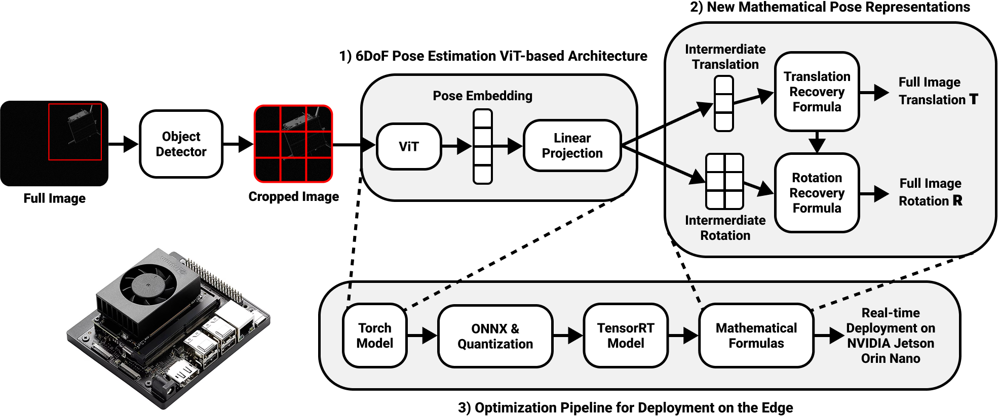

# FastPose-ViT

FastPose-ViT is a Vision Transformer (ViT) pipeline for 6D spacecraft pose estimation on the SPEED and SPEED+ datasets. It covers the full workflow from data preparation and training to NVIDIA Jetson deployment with dedicated tooling for bounding-box detection, quantization and TensorRT conversion.

## Table of Contents
- [Highlights](#highlights)
- [Repository Layout](#repository-layout)
- [Quick Start](#quick-start)
- [Pretrained Weights](#pretrained-weights)
- [Installation](#installation)
  - [Option 1: Docker (Recommended)](#option-1-docker-recommended)
  - [Option 2: Manual Python Environment](#option-2-manual-python-environment)
- [Dataset Preparation](#dataset-preparation)
  - [Steps](#steps)
  - [Directory Layout](#directory-layout)
- [Training & Evaluation](#training--evaluation)
  - [Pose Estimator (ViT)](#pose-estimator-vit)
  - [Object Detector](#object-detector)
- [Optimization & Deployment](#optimization--deployment)
  - [Pose Estimator (ViT)](#pose-estimator-vit-1)
  - [Object Detector](#object-detector-1)
  - [End-to-End Pipeline](#end-to-end-pipeline)
- [Tooling & Development](#tooling--development)
- [License](#license)
- [Citation](#citation)

## Highlights
- 6D pose regression with configurable ViT or ConvNeXt backbones and rotation/translation losses
- Integrated object detector (LW-DETR variants) to generate spacecraft bounding boxes
- End-to-end optimization pipeline with ONNX export and TensorRT for Jetson Orin Nano
- Ready-to-run Docker image as well as local setups

## Repository Layout
- `assets/`: Figures and visual assets used across the documentation
- `object_detector/`: LWDETR implementation for spacecraft detection
- `optimization/`: Conversion, calibration, and TensorRT tooling
- `other_utils/`: Utility scripts (dataset splitters, helpers, misc tools)
- `scripts/`: Experiment ablation scripts (optimizer, representation, augmentation, pretraining, etc.)
- `src/`: FastPose-ViT training, evaluation, inference, and optimization code
- `styleaug/`: Style augmentation module integrated with the training pipeline
- `tests/`: Unit and regression tests for core functionality

## Quick Start

Getting started with FastPose-ViT is straightforward. Follow these essential steps to begin training and evaluating your 6D pose estimation models:

1. Install the package (Docker or local Python environment)
2. Download SPEED / SPEED+ and create train/val/test splits
3. Train FastPose-ViT on SPEED / SPEED+
4. Evaluate the model and export predictions or latency metrics
5. (Optional) Optimize the model for Jetson deployment via ONNX -> quantization -> TensorRT

The sections below expand each step with detailed instructions and code examples.

## Pretrained Weights

Pretrained model weights trained on the SPEED dataset are available on HuggingFace:

> **[HuggingFace: FastPose-ViT](https://huggingface.co/PierreAncey/FastPose-ViT)**

| File | Description | Download |
|------|-------------|----------|
| `vit_b_16_384.pth` | ViT-B/16-384 pose estimator | [Link](https://huggingface.co/PierreAncey/FastPose-ViT/resolve/main/vit_b_16_384.pth) |
| `vit_b_16.pth` | ViT-B/16 pose estimator | [Link](https://huggingface.co/PierreAncey/FastPose-ViT/resolve/main/vit_b_16.pth) |
| `small.pth` | LW-DETR Small object detector | [Link](https://huggingface.co/PierreAncey/FastPose-ViT/resolve/main/small.pth) |

Download the weights and place them in a `weights/` directory (or any path of your choice):
```bash
mkdir -p weights
# Download from https://huggingface.co/PierreAncey/FastPose-ViT/tree/main
# Place the .pth files in weights/
```

Then reference them when running evaluation or prediction commands, e.g.:
```bash
# Pose estimator
--model_weights weights/vit_b_16_384.pth
# Object detector
--model_weights weights/small.pth
```

## Installation

To get FastPose-ViT up and running, you have several options depending on your environment and requirements. We recommend the Docker approach for consistency and ease of deployment.

### Option 1: Docker (Recommended)
**Requirements**: NVIDIA GPU with CUDA 13 capability and nvidia-cuda-toolkit installed. Tested with Ubuntu 24.04+, on A100 clusters.

Build the image:
```bash
docker build -t FastPose-ViT .
```
Run interactively with GPU access:
```bash
docker run --gpus all --shm-size=8g --rm -it FastPose-ViT
```
In practice you will want to mount your dataset and results directories:
```bash
docker run --gpus all --shm-size=8g --rm -it \
  -v ./SPEED_FIXED:/app/SPEED_FIXED \
  -v ./results:/app/results \
  FastPose-ViT
```

### Option 2: Manual Python Environment
1. Install TensorRT 10.13:
    ```bash
    pip install --break-system-packages --system --upgrade tensorrt
    ```
2. Create a Python 3.12 virtual environment (venv, uv or conda)
3. Install PyTorch first, then FastPose-ViT and its dependencies:
   ```bash
   pip install -r requirements-pytorch.txt
   pip install -e .
   ```
4. Compile the LW-DETR CUDA extension (required for the object detector):
   ```bash
   cd object_detector/LWDETR/lwdetr_ops
   chmod +x make.sh && ./make.sh
   cd ../../..
   ```

## Dataset Preparation

Before training or evaluating FastPose-ViT models, you'll need to prepare the SPEED and SPEED+ datasets with appropriate directory structures and bounding box annotations. We support three dataset variants for different training and evaluation scenarios.

FastPose-ViT expects the official SPEED and SPEED+ datasets with additional JSON annotations for bounding boxes. We support three kinds of datasets:
- SPEED, constituted mostly of synthetic images
- SPEED+, constituted of synthetic images for training and real images for testing
- SPEED+ synthetic (containing only the synthetic data from the SPEED+ dataset, even during evaluation)
You can choose which dataset to train/evaluate on with the argument `--dataset` assuming you have the following folder structure:
  - `SPEED` → `SPEED_FIXED`
  - `SPEED_PLUS_SYNTHETIC` → `SPEED_PLUS_SYNTHETIC_FIXED`
  - `SPEED_PLUS` → `SPEED_PLUS_FIXED`

To obtain the folder structure, you need to follow the steps:

### Steps
1. Download the [SPEED](https://zenodo.org/records/6327547) / [SPEED+](https://zenodo.org/records/5588480) archives from Zenodo and extract the folder from the zip.
2. Place the extracted folders in the repository with the README (or anywhere else and point `--dataset_root_dir` at it)
3. Generate train/val/test splits if needed:
   ```bash
    python3 other_utils/dataset_preparation/speed_dataset_splitter.py
    python3 other_utils/dataset_preparation/speedplus_dataset_splitter.py
    python3 other_utils/dataset_preparation/speedplus_synthetic_dataset_splitter.py
   ```
4. Move the bounding boxes annotations file to its correct folder, i.e.:
- `/assets/speed_bbox_annotations.json` -> `/SPEED_FIXED/speed_bbox_annotations.json` 
- `/assets/speed_plus_synthetic_bbox_annotations.json` -> `/SPEED_PLUS_SYNTHETIC_FIXED/speed_plus_synthetic_bbox_annotations.json`
- `/assets/speed_plus_bbox_annotations.json` -> `/SPEED_PLUS_FIXED/speed_plus_bbox_annotations.json` 
You should have the following layout stucture, for example for `SPEED` as a result:

### Directory Layout
```
SPEED_FIXED/
├── images/
│   ├── train/
│   ├── val/
│   └── test/
├── train.json
├── val.json
├── test.json
└── speed_bbox_annotations.json
```


## Training & Evaluation

With your dataset prepared, you can now train and evaluate FastPose-ViT models. This section covers the essential commands for training, evaluation, prediction generation, and latency benchmarking.

All command snippets assume you are inside the repository root.

### Pose Estimator (ViT)

<details>
<summary>Standard FastPose-ViT Training</summary>

#### Standard FastPose-ViT Training
For optimal performance with vit-b-16-384:
```bash
DATASET=SPEED_FIXED && \
RES_DIR=results/vit-b-16-384 && \
python3 src/train.py \
--model_save_path $RES_DIR/model.pth \
--log_dir $RES_DIR/ \
--rotation_format matrix \
--rotation_loss 6d_relative_frobenius \
--translation_loss relative_translation \
--max_lr 1e-4 \
--min_lr 1e-6 \
--epochs 310 \
--num_hidden_layers 0 \
--hidden_layer_dim 0 \
--nb_class_tokens 1 \
--batch_size 8 \
--vit_model vit_b_16_384 \
--dataset SPEED \
--dataset_root_dir $DATASET/ \
--optimizer muon \
--scheduler cosineannealingwarmrestarts \
--num_workers 8 \
--merge_outputs \
--no_mlp \
--no_pixel_augmentation \
--bbox_crop_percent 10
```
Naturally, to train on the SPEED+ datasets, you just need to update the valued of the `DATASET` variable and the value of the argument `--dataset`.
</details>

<details>
<summary>Evaluation</summary>

#### Evaluation
```bash
DATASET=SPEED_FIXED && \
RES_DIR=results/vit-b-16-384 && \
python3 src/evaluate.py \
--model_weights $RES_DIR/model.pth \
--log_dir $RES_DIR/ \
--rotation_format matrix \
--num_hidden_layers 0 \
--hidden_layer_dim 0 \
--nb_class_tokens 1 \
--batch_size 8 \
--vit_model vit_b_16_384 \
--dataset SPEED \
--dataset_root_dir $DATASET \
--output_json $RES_DIR/results.json \
--num_workers 8 \
--merge_outputs \
--no_mlp
```
</details>

<details>
<summary>Prediction on SPEED for submission</summary>

#### Prediction on SPEED for submission
CSV predictions for submission 
```bash
DATASET=SPEED_FIXED && \
RES_DIR=results/vit-b-16-384 && \
python3 src/predict.py \
--dataset SPEED \
--dataset_root_dir $DATASET \
--model_weights $RES_DIR/model.pth \
--output_csv $RES_DIR/predictions.csv \
--vit_model vit_b_16_384 \
--rotation_format matrix \
--batch_size 8 \
--merge_outputs \
--no_mlp \
--nb_class_tokens 1
```
</details>

<details>
<summary>Latency Benchmark (PyTorch)</summary>

#### Latency Benchmark (PyTorch)
```bash
DATASET=SPEED_FIXED && \
RES_DIR=results/vit-b-16-384 && \
python3 optimization/evaluate_torch_latency.py \
--model_weights $RES_DIR/model.pth \
--log_dir $RES_DIR/ \
--rotation_format matrix \
--num_hidden_layers 0 \
--hidden_layer_dim 0 \
--nb_class_tokens 1 \
--batch_size 1 \
--vit_model vit_b_16_384 \
--dataset SPEED \
--dataset_root_dir $DATASET \
--num_workers 8 \
--merge_outputs \
--no_mlp
```
</details>

### Object Detector

FastPose-ViT includes an integrated object detection pipeline using LW-DETR variants to generate spacecraft bounding boxes for SPEED/SPEED+ frames. This is a critical preprocessing step for pose estimation that crops the image around the spacecraft before feeding it to the pose estimator.

The detector is fine-tuned from COCO-pretrained LW-DETR weights (60 epochs). Download them from the [LW-DETR GitHub](https://github.com/Atten4Vis/LW-DETR) and place them in a `lwdetr_weights/` folder. Available variants: `tiny`, `small`, `medium`, `large`.

<details>
<summary>Training</summary>

#### Training

Fine-tune a LW-DETR detector on SPEED/SPEED+ spacecraft images. The `--static_training` flag freezes the backbone and only trains the detection head, which speeds up convergence and reduces overfitting on the small single-class dataset.

```bash
PRETRAINED_LW_DETR_WEIGHTS=lwdetr_weights && \
DATASET=SPEED_FIXED && \
RES_DIR=results/bbox && \
python3 object_detector/train.py \
--dataset_root_dir $DATASET/ \
--model_variant small \
--batch_size 8 \
--max_lr 5e-4 \
--min_lr 5e-5 \
--scheduler cosineannealingwarmrestarts \
--epochs 70 \
--pretrain_weights $PRETRAINED_LW_DETR_WEIGHTS/LWDETR_small_60e_coco.pth \
--num_workers 8 \
--model_save_path $RES_DIR/model.pth \
--log_dir $RES_DIR/ \
--static_training
```
</details>

<details>
<summary>Evaluation</summary>

#### Evaluation

Evaluate the trained detector on the validation split, reporting mAP and per-image IoU metrics.

```bash
DATASET=SPEED_FIXED && \
RES_DIR=results/bbox && \
python3 object_detector/evaluate.py \
--dataset_root_dir $DATASET \
--model_variant small \
--model_weights $RES_DIR/model.pth  \
--output_dir $RES_DIR/ \
--log_dir $RES_DIR/
```
</details>

<details>
<summary>Prediction on a folder</summary>

#### Prediction on a folder

Run the detector on an arbitrary image folder and save the predicted bounding boxes. Use `--save_visualizations` to also write images with the boxes overlaid, useful for debugging and qualitative analysis.

```bash
DATASET=SPEED_FIXED && \
RES_DIR=results/bbox && \
python3 object_detector/predict_on_folder.py \
--images_dir SPEED_FIXED/images/test \
--model_variant small \
--model_weights $RES_DIR/model.pth  \
--output_dir $RES_DIR/ \
--log_dir $RES_DIR/ \
--save_visualizations
```
</details>

## Optimization & Deployment

For deployment on NVIDIA Jetson devices, FastPose-ViT includes a comprehensive optimization pipeline that converts models through ONNX to TensorRT engines. This section details the optimization process for both the pose estimator and object detector components.

FastPose-ViT ships with tooling to export ONNX graphs, build TensorRT engines, and profile latency on Jetson-class hardware. The snippets below assume you already trained the pose estimator (`results/vit-b-16-384`) and detector (`results/bbox`).

### Pose Estimator (ViT)

<details>
<summary>1. Export to ONNX</summary>

```bash
RES_DIR=results/vit-b-16-384 && \
python3 optimization/convert_to_onnx.py \
--model_weights $RES_DIR/model.pth \
--log_dir $RES_DIR/ \
--rotation_format matrix \
--num_hidden_layers 0 \
--hidden_layer_dim 0 \
--nb_class_tokens 1 \
--vit_model vit_b_16_384 \
--merge_outputs \
--no_mlp \
--onnx_model_path $RES_DIR/model.onnx
```

</details>

<details>
<summary>2. Build the TensorRT engine</summary>

(`--fp16` enables mixed precision)

```bash
RES_DIR=results/vit-b-16-384 && \
python3 optimization/convert_onnx_to_trt.py \
--onnx_path $RES_DIR/model.onnx \
--engine_path $RES_DIR/model.trt \
--vit_model vit_b_16_384 \
--batch_size 1 \
--log_dir $RES_DIR/
```

</details>

<details>
<summary>3. Benchmark inference latency</summary>

```bash
DATASET=SPEED_FIXED && \
RES_DIR=results/vit-b-16-384 && \
python3 optimization/evaluate_trt_performance.py \
--trt_engine_path $RES_DIR/model.trt \
--vit_model vit_b_16_384 \
--batch_size 1 \
--log_dir $RES_DIR/ \
--output_json $RES_DIR/trt_performance_python.json \
--dataset SPEED \
--rotation_format matrix \
--dataset_root_dir $DATASET \
--merge_outputs \
--no_mlp
```

</details>

### Object Detector

<details>
<summary>1. Export to ONNX</summary>

```bash
RES_DIR=results/bbox && \
python3 optimization/convert_to_onnx.py \
--model_weights $RES_DIR/model.pth \
--log_dir $RES_DIR/ \
--onnx_model_path $RES_DIR/model.onnx \
--detector_variant small \
--model_type detector \
--static_export
```

</details>

<details>
<summary>2. Build the TensorRT engine</summary>

(add `--fp16` for mixed precision)

```bash
RES_DIR=results/bbox && \
python3 optimization/convert_onnx_to_trt.py \
--model_type detector \
--detector_variant small \
--onnx_path $RES_DIR/model.onnx \
--engine_path $RES_DIR/model.trt
```

</details>

<details>
<summary>3. Benchmark detector latency</summary>

```bash
RES_DIR=results/bbox && \
python3 optimization/evaluate_trt_performance.py \
--mode detector \
--trt_engine_detector_path $RES_DIR/model.trt \
--detector_num_samples 500 \
--output_json $RES_DIR/trt_performance_python.json
```

</details>

### End-to-End Pipeline

<details>
<summary>Evaluate both TensorRT engines in a single pass to capture end-to-end latency and post-processing overhead</summary>

```bash
DATASET=SPEED_FIXED && \
VIT_RES_DIR=results/vit-b-16-384 && \
OBJ_RES_DIR=results/bbox && \
python3 optimization/evaluate_trt_performance.py \
--mode pipeline \
--trt_engine_pose_path $VIT_RES_DIR/model.trt \
--trt_engine_detector_path $OBJ_RES_DIR/model.trt \
--dataset SPEED \
--dataset_root_dir $DATASET \
--vit_model vit_b_16_384 \
--batch_size 1 \
--rotation_format matrix \
--merge_outputs \
--no_mlp \
--detector_num_samples 500 \
--num_workers 4 \
--measure_postproc \
--log_dir $VIT_RES_DIR/ \
--output_json $VIT_RES_DIR/trt_performance_both.json
```

</details>

## Tooling & Development

To support ongoing development and experimentation, FastPose-ViT includes various tooling options for testing, linting, and script execution. These tools help maintain code quality and enable rapid prototyping of new features.

- **Testing**: `pytest ./tests/`
- **Linting/Formatting**: `ruff check --fix` then `ruff format`
- **Scripts**: `scripts/optimizer.sh`, `scripts/object_detector.sh`, `scripts/representation.sh`, `scripts/speedplus.sh`, `scripts/pretraining.sh`, etc. cover experiment ablations
- **Logging**: Training and evaluation store TensorBoard summaries in the chosen `--log_dir`

## License

This project is licensed under the **MIT License**, see the [LICENSE](LICENSE) file for details.

Third-party components are distributed under their original licenses:
- `object_detector/LWDETR/` | Apache 2.0 (from [LW-DETR](https://github.com/Atten4Vis/LW-DETR))
- `styleaug/` | MIT (from [style-augmentation](https://github.com/philipjackson/style-augmentation))

## Citation

If you use FastPose-ViT in your research, please cite:

```bibtex
@InProceedings{Ancey_2026_WACV,
    author    = {Ancey, Pierre and Price, Andrew and Javed, Saqib and Salzmann, Mathieu},
    title     = {FastPose-ViT: A Vision Transformer for Real-Time Spacecraft Pose Estimation},
    booktitle = {Proceedings of the IEEE/CVF Winter Conference on Applications of Computer Vision (WACV)},
    month     = {March},
    year      = {2026},
    pages     = {7873-7882}
}
```
